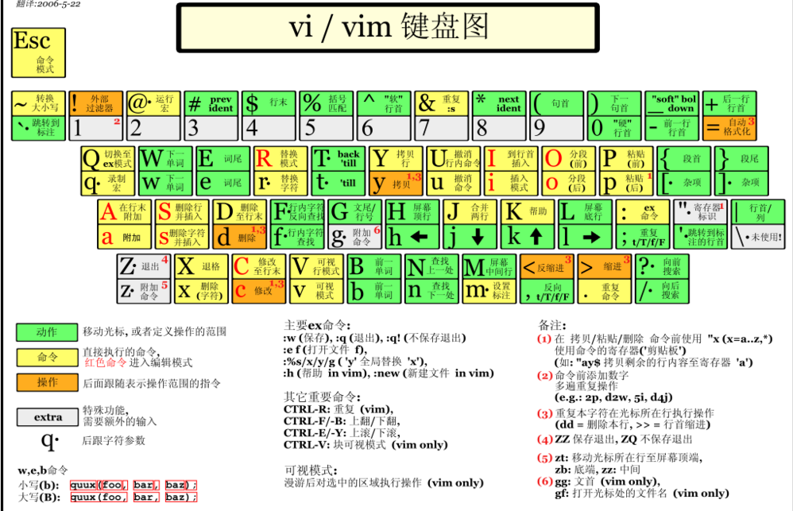

## Linux

### Liunx系统文件介绍

- Linux系统环境下的文件系统与Windows有很大区别。 在Windows中，每一个盘符下是一个独立的文件系统，硬盘有多少个分区就有多少个文件系统。而在Linux系统中不管创建了多少个硬盘分区都只有一个文件系统。整个文件系统的根目录是“/”，从“/”出发可以找到Linux系统中的所有目录和文件。

- 文件与目录结构

  | 目录名         | 是否重要 | 作用                                                         |
  | -------------- | -------- | ------------------------------------------------------------ |
  | /bin           |          | bin是binary的缩写，这个目录存放着最经常使用的命令。          |
  | /boot          |          | 这里存放的是启动Linux时用到的引导程序文件。                  |
  | /dev           |          | device(设备)的缩写，该目录下存放的是Linux的外部设备。        |
  | /etc           | √        | 存放系统和第三方应用程序的配置文件。                         |
  | /home          | √        | 存放普通用户家目录。                                         |
  | /lib 和 /lib64 |          | 系统开机所需要最基本的动态连接共享库。                       |
  | /media         |          | 挂载Linux系统会自动识别的设备，例如U盘、光驱等。             |
  | /mnt           |          | mnt是mount（挂载）的缩写，这个目录专门用于挂载操作的目录。   |
  | /opt           | √        | 存放安装第三方应用程序时使用的压缩包文件。                   |
  | /proc          |          | 这个目录是一个虚拟的目录，它是系统内存的映射。               |
  | /root          | √        | 超级管理员root用户的家目录。                                 |
  | /run           |          | 存放进程产生的临时文件，关机重启后会消失。                   |
  | /sbin          |          | s是Super User的意思，这里存放的是系统管理员使用的系统管理程序。 |
  | /srv           |          | service缩写，该目录存放一些服务启动之后需要提取的数据。      |
  | /sys           |          | 该目录下安装了2.6内核中新出现的一个文件系统sysfs。           |
  | /tmp           |          | 存放临时文件。                                               |
  | /usr           | √        | 应用程序的默认安装目录，类似于Windows下的program files目录。 |
  | /var           | √        | 存放经常变化的内容，例如日志文件。                           |

- Linux系统中的路径

  - 相对路径：绝对路径：从“/”根目录开始逐层查找文件和目录

  - 绝对路径：以当前目录或上一级目录为基准逐层查找文件和目录

    > 当前目录：“./” 当前目录的上一级目录：“../”
    >
    > “./”可以省略不写，也同样表示当前目录。
    >
    > 易错点：“/”代表的是最顶层、最上面的那个根目录

### 常用快捷键

| 按键             | 作用         |
| ---------------- | ------------ |
| **Ctrl+l**       | 清屏         |
| **Ctrl+c**       | 强制终止程序 |
| **Ctrl+Insert**  | 复制         |
| **Shift+Insert** | 粘贴         |
| **Ctrl+s**       | 锁屏         |
| **Ctrl+q**       | 解除锁屏     |
| **tab**          | 自动补全     |

### vi 和 vim 编辑器

- 使用命令: vi xxx文件  或者 vim xxx文件

- 三种模式：

  - 一般模式（默认模式：只读）

    | **按键** | **效果**                  |
    | -------- | ------------------------- |
    | **dd**   | **删除光标当前行**        |
    | **dnd**  | **删除n行**               |
    | **u**    | **撤销上一步**            |
    | **x**    | **删除一个字母 Delete**   |
    | **yy**   | **复制光标当前行**        |
    | **p**    | **粘贴**                  |
    | **dw**   | **删除一个词**            |
    | **yw**   | **复制一个词**            |
    | **X**    | **删除一个字母Backspace** |

    打开文档的默认模式，主要负责查看，和一些基础的修剪

    | **按键**          | **效果**         |
    | ----------------- | ---------------- |
    | **shift+g**       | **移动到页尾**   |
    | **数字1+shift+g** | **移动到页头**   |
    | **数字N+shift+g** | **移动到目标行** |
    | **shift+6**       | **移动到行头**   |
    | **shift+4**       | **移动到行尾**   |

  - 编辑模式：

    - 要按下  i , a ,o,等字母后才能进入编辑模式

    - 进入后左下角会有[insert]或[replace]的字样

    - 按下[ESC]这个按键即可退出编辑模式

      | **按键** | **效果**                                          |
      | -------- | ------------------------------------------------- |
      | **i**    | **当前光标前**                                    |
      | **a**    | **当前光标后**                                    |
      | **o**    | **当前光标行的下一行**                            |
      | **s,S**  | **s:删除当前字符并进入编辑 S:删除整行并进入编辑** |
      | **R**    | **进入替换模式，替换光标后内容**                  |

  - 命令模式可以进行存盘、退出、显示行号、搜索、批量替换等操作。要在一般模式下输入" / "或 " : "  可进入命令模式进入后光标移至最下端。

    | **命令**                   | **含义**                     |
    | -------------------------- | ---------------------------- |
    | **: w**                    | **保存**                     |
    | **: q**                    | **退出**                     |
    | **: !**                    | **强制执行**                 |
    | **: %s/old字符/new字符/g** | **批量替换**                 |
    | **/ 要查找的词**           | **n 查找下一个，N 往上查找** |
    |                            | **N 查找下一个，n 往上查找** |
    | **:set nu / :set nonu**    | **显示行号 /关闭行号**       |
    | **:noh**                   | **取消高亮显示**             |

- 

### Liunx常用命令

- ifconfig：ifconfig是Linux中常用的[网络配置](https://so.csdn.net/so/search?q=网络配置&spm=1001.2101.3001.7020)工具之一，用于配置和显示网络接口的具体状况。

- mkdir：创建目录

  - 创建单层目录：mkdir 新目录的路径

    > 创建单层目录：mkdir 新目录的路径
    >
    > mkdir aaa/bbb/ccc
    >
    > 其中aaa/bbb是存在的目录，要创建的仅仅是ccc

  - 创建多层目录：mkdir -p 新目录的路径

    > 多层目录说明：
    >
    > mkdir -p aaa/bbb/ccc/ddd
    >
    > 其中bbb/ccc/ddd都不存在，现在想一次性把这些目录都建出来

- cd：切换当前目录。 cd 目标目录路径

  > 用法1：使用绝对路径
  >
  > 用法2：使用相对路径
  >
  > 用法3：使用~回到家目录
  
- ls：列出目录中的内容，这里所说的目录可以是当前目录也可以是其他目录（需要指定路径）

- pwd：打印当前所在的目录

- touch：创建空文件；格式：touch 新建文件的路径

- cp：复制文件或目录

  > 复制文件：cp 被复制的文件的路径 目标目录的路径
  >
  > 复制目录：cp -r 被复制的目录的路径 目标目录的路径

- mv：移动文件或目录

  >mv 被移动的文件或目录的路径 目标目录
  >
  >特殊效果：将目录或文件在当前位置移动可以起到重命名的作用

- rm：remove删除目录或文件

  > 删除文件：rm 被删除的文件的路径
  >
  > 强制删除文件：rm -f 被删除的文件的路径
  >
  > 递归删除目录：rm -r 被删除的目录的路径
  >
  > 强制删除目录：rm -rf 被删除的目录的路径

- cat：显示文件全部内容；适用场景：较短小的文件

- less：作用：分屏查看文件内容

- tail：显示文件末尾的部分内容

- find：查找文件或目录

  > 用法：find 查找范围 参数 表达式

- locate：locate命令同样是用来查询文件或目录

- grep：将文件内容中匹配的行返回

  > 用法：grep 参数 查找内容 源文件

- pipe：管道不是命令，而是一个符号：“|”。它的用法是：命令A | 命令B。作用是把命令A的输出作为命令B的输入。

- tar：tar -zxvf tar包路径：默认解压到当前目录下，如果当前目录下有同名的目录或文件会被直接覆盖，没有任何提示，这一点请大家注意

  | 参数名称 | 作用                              |
  | -------- | --------------------------------- |
  | -z       | 用 gzip 对存档压缩或解压          |
  | -x       | 解压                              |
  | -v       | 详细显示处理的文件                |
  | -f       | 指定存档或设备 (缺省为 /dev/rmt0) |

### 进程相关命令

- ps：查看当前正在运行的进程

  >常用参数组合：ps -ef
  >
  >-e参数：对应单词entire，表示全部。具体指显示系统中全部的进程信息。
  >
  >-f参数：对应单词full-formate，表示完整格式。

  - 进程信息中各列数据说明

    | 列名  | 含义                                                     |
    | ----- | -------------------------------------------------------- |
    | UID   | 进程的用户信息                                           |
    | PID   | 进程id。由系统分配，不会重复。                           |
    | PPID  | 父进程的id。父进程和子进程的关系是：父进程启动了子进程。 |
    | CMD   | 当前进程所对应的程序。                                   |
    | C     | 用整数表示的CPU使用率                                    |
    | STIME | 进程启动时间                                             |
    | TTY   | 进程所在终端。所谓终端就是用户输入命令的操作界面。       |
    | TIME  | 进程所占用的CPU时间                                      |

- kill：杀死进程

- top：实时查看系统运行情况和健康状态。

  - 命令与参数：

    | 命令名 | 更新时间间隔（秒） | 不显示任何闲置或者僵死进程 | 通过进程id监控单一进程 |
    | ------ | ------------------ | -------------------------- | ---------------------- |
    | top    | -d 间隔秒数        | -i                         | -p 进程id              |

  - 操作控制：

    | 按键 | 功能                             |
    | ---- | -------------------------------- |
    | P    | 默认值，根据CPU使用率排序        |
    | M    | 以内存的使用率排序               |
    | N    | 以PID排序                        |
    | d    | 设置数据刷新的时间间隔，单位是秒 |
    | q    | 退出                             |

- netstat：查看网络状态

  | 参数名 | 作用                                             |
  | ------ | ------------------------------------------------ |
  | -a     | 显示所有正在或不在侦听的套接字。                 |
  | -n     | 显示数字形式地址而不是去解析主机、端口或用户名。 |
  | -p     | 显示套接字所属进程的PID和名称。                  |

- curl：通过命令给服务器发送请求
- wget：下载文件
