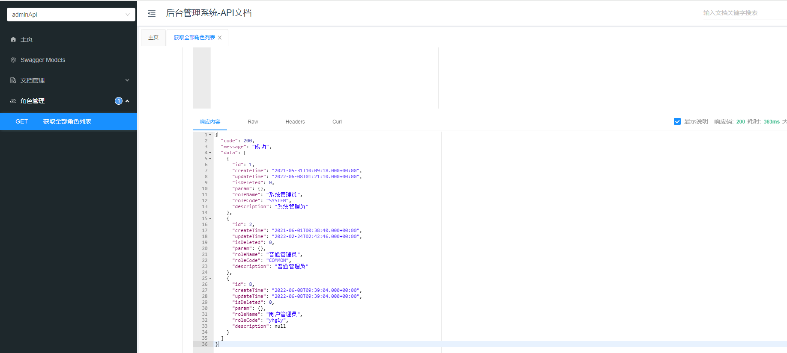
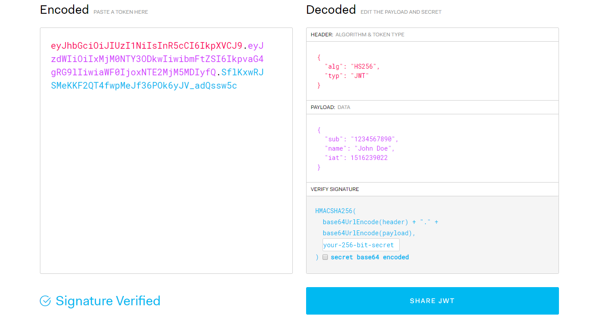
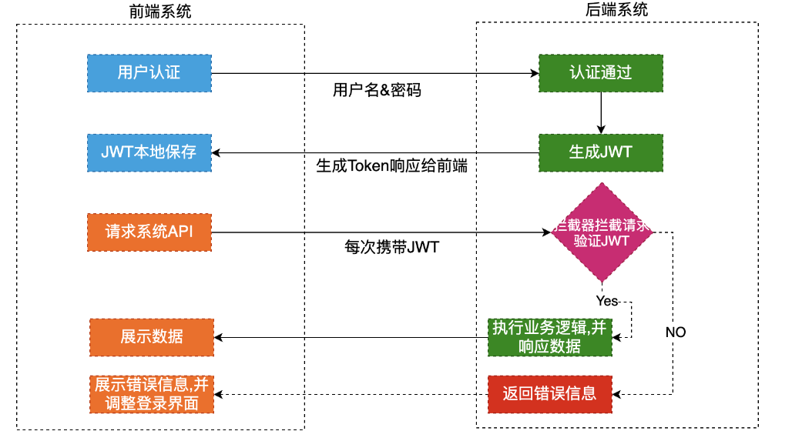
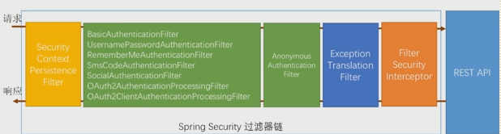

## 通用权限系统

### 介绍

- 权限管理是所有后台系统都会涉及的一个重要组成部分，而权限管理的核心流程是相似的，如果每个后台单独开发一套权限管理系统，就是重复造轮子，是人力的极大浪费，本项目就是针对这个问题，提供了一套通用的权限解决方案。

- 项目服务器端架构：SpringBoot + MyBatisPlus + SpringSecurity

- 前端架构：Node.js + Npm + Vue + ElementUI + Axios

  | 基础框架：SpringBoot                              |
  | ------------------------------------------------- |
  | 数据缓存：Redis                                   |
  | 数据库：Mysql                                     |
  | 权限控制：SpringSecurity                          |
  | 全局日志记录：AOP                                 |
  | 前端模板：vue-admin-template                      |
  | 前端技术：Node.js + Npm + Vue + ElementUI + Axios |

### 项目搭建

```
pokaboo-auth-parent：根目录，管理子模块：

​	common：公共类父模块

​		common-log：系统操作日志模块

​		common-util：核心工具类

​		service-util：service模块工具类

​		spring-security：spring-security业务模块

​	model：实体类模块

​	service-system：系统权限模块
```

### 数据库

### 角色管理

- 定义统一返回结果对象：

  > 项目中我们会将响应封装成json返回，一般我们会将所有接口的数据格式统一， 使前端(iOS Android, Web)对数据的操作更一致、轻松。一般情况下，统一返回数据格式没有固定的格式，只要能描述清楚返回的数据状态以及要返回的具体数据就可以。但是一般会包含状态码、返回消息、数据这几部分内容例如，我们的系统要求返回的基本数据格式如下：

  - 列表：

    ```java
    {
      "code": 200,
      "message": "成功",
      "data": [
        {
          "id": 2,
          "roleName": "系统管理员"
        }
      ],
      "ok": true
    }
    
    ```

  - 分页:

    ```java
    {
      "code": 200,
      "message": "成功",
      "data": {
        "records": [
          {
            "id": 2,
            "roleName": "系统管理员"
          },
          {
            "id": 3,
            "name": "普通管理员"
          }
        ],
        "total": 10,
        "size": 3,
        "current": 1,
        "orders": [],
        "hitCount": false,
        "searchCount": true,
        "pages": 2
      },
      "ok": true
    }
    ```

  - 没有返回数据

    ```java
    {
      "code": 200,
      "message": "成功",
      "data": null,
      "ok": true
    }
    ```

- 代码实例：

  ```java
  
  import lombok.Data;
  
  /**
   * 全局统一返回结果类
   *
   */
  @Data
  public class Result<T> {
  
      //返回码
      private Integer code;
  
      //返回消息
      private String message;
  
      //返回数据
      private T data;
  
      public Result(){}
  
      // 返回数据
      protected static <T> Result<T> build(T data) {
          Result<T> result = new Result<T>();
          if (data != null)
              result.setData(data);
          return result;
      }
  
      public static <T> Result<T> build(T body, Integer code, String message) {
          Result<T> result = build(body);
          result.setCode(code);
          result.setMessage(message);
          return result;
      }
  
      public static <T> Result<T> build(T body, ResultCodeEnum resultCodeEnum) {
          Result<T> result = build(body);
          result.setCode(resultCodeEnum.getCode());
          result.setMessage(resultCodeEnum.getMessage());
          return result;
      }
  
      public static<T> Result<T> ok(){
          return Result.ok(null);
      }
  
      /**
       * 操作成功
       * @param data  baseCategory1List
       * @param <T>
       * @return
       */
      public static<T> Result<T> ok(T data){
          Result<T> result = build(data);
          return build(data, ResultCodeEnum.SUCCESS);
      }
  
      public static<T> Result<T> fail(){
          return Result.fail(null);
      }
  
      /**
       * 操作失败
       * @param data
       * @param <T>
       * @return
       */
      public static<T> Result<T> fail(T data){
          Result<T> result = build(data);
          return build(data, ResultCodeEnum.FAIL);
      }
  
      public Result<T> message(String msg){
          this.setMessage(msg);
          return this;
      }
  
      public Result<T> code(Integer code){
          this.setCode(code);
          return this;
      }
  }
  ```

  ```java
  import lombok.Getter;
  
  /**
   * 统一返回结果状态信息类
   *
   */
  @Getter
  public enum ResultCodeEnum {
  
      SUCCESS(200,"成功"),
      FAIL(201, "失败"),
      SERVICE_ERROR(2012, "服务异常"),
      DATA_ERROR(204, "数据异常"),
      ILLEGAL_REQUEST(205, "非法请求"),
      REPEAT_SUBMIT(206, "重复提交"),
      ARGUMENT_VALID_ERROR(210, "参数校验异常"),
  
      LOGIN_AUTH(208, "未登陆"),
      PERMISSION(209, "没有权限"),
      ACCOUNT_ERROR(214, "账号不正确"),
      PASSWORD_ERROR(215, "密码不正确"),
      LOGIN_MOBLE_ERROR( 216, "账号不正确"),
      ACCOUNT_STOP( 217, "账号已停用"),
      NODE_ERROR( 218, "该节点下有子节点，不可以删除")
      ;
  
      private Integer code;
  
      private String message;
  
      private ResultCodeEnum(Integer code, String message) {
          this.code = code;
          this.message = message;
      }
  }
  ```


### 集成knife4j

文档地址：https://doc.xiaominfo.com/

knife4j是为Java MVC框架集成Swagger生成Api文档的增强解决方案。

- 添加依赖

  ```xml
  <dependency>
      <groupId>com.github.xiaoymin</groupId>
      <artifactId>knife4j-spring-boot-starter</artifactId>
  </dependency>
  ```

- 添加knife4j配置类

  ```java
  import org.springframework.context.annotation.Bean;
  import org.springframework.context.annotation.Configuration;
  import springfox.documentation.builders.ApiInfoBuilder;
  import springfox.documentation.builders.ParameterBuilder;
  import springfox.documentation.builders.PathSelectors;
  import springfox.documentation.builders.RequestHandlerSelectors;
  import springfox.documentation.schema.ModelRef;
  import springfox.documentation.service.ApiInfo;
  import springfox.documentation.service.Contact;
  import springfox.documentation.service.Parameter;
  import springfox.documentation.spi.DocumentationType;
  import springfox.documentation.spring.web.plugins.Docket;
  import springfox.documentation.swagger2.annotations.EnableSwagger2WebMvc;
  
  import java.util.ArrayList;
  import java.util.List;
  
  /**
   * knife4j配置信息
   */
  @Configuration
  @EnableSwagger2WebMvc
  public class Knife4jConfig {
  
      @Bean
      public Docket adminApiConfig(){
          List<Parameter> pars = new ArrayList<>();
          ParameterBuilder tokenPar = new ParameterBuilder();
          tokenPar.name("token")
                  .description("用户token")
                  .defaultValue("")
                  .modelRef(new ModelRef("string"))
                  .parameterType("header")
                  .required(false)
                  .build();
          pars.add(tokenPar.build());
          //添加head参数end
  
          Docket adminApi = new Docket(DocumentationType.SWAGGER_2)
                  .groupName("adminApi")
                  .apiInfo(adminApiInfo())
                  .select()
                  //只显示admin路径下的页面
                  .apis(RequestHandlerSelectors.basePackage("com.atguigu"))
                  .paths(PathSelectors.regex("/admin/.*"))
                  .build()
                  .globalOperationParameters(pars);
          return adminApi;
      }
  
      private ApiInfo adminApiInfo(){
  
          return new ApiInfoBuilder()
                  .title("后台管理系统-API文档")
                  .description("本文档描述了后台管理系统微服务接口定义")
                  .version("1.0")
                  .contact(new Contact("qy", "http://pokaboo.cn", "pokaboo@163.com"))
                  .build();
      }
  
  }
  ```

- 注解

  - @Api ：添加在控制器类上，通过此注解的tags属性，可以指定模块名称，并且，在指定名称时，建议在名称前添加数字作为序号，Knife4j会根据这些数字将各模块升序排列，例如：

    > ```java
    > @Api(value = "提供商品添加、修改、删除及查询的相关接⼝",tags = "01.商品管理")
    > ```

  - @ApiOpearation：添加在Api中处理请求的方法上，通过此注解的value属性，可以指定业务/请求资源的名称，例如：

    > ```java
    > @ApiOperation("添加商品")
    > ```

  - @ApiOperationSupport：添加在Api中处理请求的方法上，通过此注解的order属性（int），可以指定排序序号，Knife4j会根据这些数字将各业务/请求资源升序排列，例如：

    > ```java
    > @ApiOperationSupport(order = 100) 
    > ```

  - @ApiImplicitParams 和 @ApiImplicitParam：对于处理请求的方法的参数列表中那些未封装的参数（例如String、Long），需要在处理请求的方法上使用此注解来配置参数的说明，并且，必须配置name属性，此属性的值就是方法的参数名称，使得此注解的配置与参数对应上，然后，再通过value属性对参数进行说明，还要注意，此属性的required属性表示是否必须提交此参数，默认为false。另外，还可以通过dataType配置参数的数据类型，如果未配置此属性，在API文档中默认显示为string，可以按需修改为int、long等。例如：

    > ```java
    > @ApiImplicitParams({
    >  @ApiImplicitParam(dataType = "string",name = "username", value = "⽤户登录账号",required =
    > true),
    >  @ApiImplicitParam(dataType = "string",name = "password", value = "⽤户登录密码",required =
    > false,defaultValue = "111111")
    > })
    > ```

  - @ApiModel：用来对实体类进行说明，例如：

    > ```java
    > @ApiModel(value = "User对象",description = "⽤户信息")
    > ```

  - @ApiModelProperty:作用在实体类的参数上，如果处理请求时，参数是封装的POJO类型，需要对各请求参数进行说明时，应该在此POJO类型的各属性上使用此注解，通过此注解的value属性配置请求参数的名称，通过requeired属性配置是否必须提交此请求参数（并不具备检查功能），例如：

    > ```java
    > @ApiModelProperty(dataType = "String",required = true, value = "⽤户注册账号")
    > ```

- 访问：http://ip:port/doc.html

​	


### JWT

- JWT是JSON Web Token的缩写，即JSON Web令牌，是一种自包含令牌。 是为了在网络应用环境间传递声明而执行的一种基于JSON的开放标准。JWT的声明一般被用来在身份提供者和服务提供者间传递被认证的用户身份信息，以便于从资源服务器获取资源。比如用在用户登录上。JWT最重要的作用就是对 token信息的防伪作用。

- **JWT令牌的组成**：一个JWT由三个部分组成：**JWT头、有效载荷、签名哈希**最后由这三者组合进行base64url编码得到JWT。典型的，一个JWT看起来如下图：该对象为一个很长的字符串，字符之间通过"."分隔符分为三个子串。https://jwt.io/

  

- **JWT头**：WT头部分是一个描述JWT元数据的JSON对象，通常如下所示。

  ```json
   {  
     "alg": "HS256",  
     "typ": "JWT"
   }
  在上面的代码中，alg属性表示签名使用的算法，默认为HMAC SHA256（写为HS256）；
  typ属性表示令牌的类型，JWT令牌统一写为JWT。
  最后，使用Base64 URL算法将上述JSON对象转换为字符串保存。
  ```

- **有效载荷**：有效载荷部分，是JWT的主体内容部分，也是一个JSON对象，包含需要传递的数据。 JWT指定七个默认字段供选择。

  ```json
  iss: jwt签发者
  sub: 主题
  aud: 接收jwt的一方
  exp: jwt的过期时间，这个过期时间必须要大于签发时间
  nbf: 定义在什么时间之前，该jwt都是不可用的.
  iat: jwt的签发时间
  jti: jwt的唯一身份标识，主要用来作为一次性token,从而回避重放攻击。
  ```

  - 除以上默认字段外，我们还可以自定义私有字段，如下例：

    ```
    {
      "name": "Helen",
      "role": "editor",
      "avatar": "helen.jpg"
    }
    ```

  - 请注意，默认情况下JWT是未加密的，任何人都可以解读其内容，因此不要构建隐私信息字段，存放保密信息，以防止信息泄露。

  - JSON对象也使用Base64 URL算法转换为字符串保存。

- **签名哈希**：签名哈希部分是对上面两部分数据签名，通过指定的算法生成哈希，以确保数据不会被篡改。首先，需要指定一个密码（secret）。该密码仅仅为保存在服务器中，并且不能向用户公开。然后，使用标头中指定的签名算法（默认情况下为HMAC SHA256）根据以下公式生成签名。

  ```
  HMACSHA256(base64UrlEncode(header) + "." + base64UrlEncode(claims), secret)    ==>   签名hash
  ```

  - 在计算出签名哈希后，JWT头，有效载荷和签名哈希的三个部分组合成一个字符串，每个部分用"."分隔，就构成整个JWT对象。

- **Base64URL算法**：如前所述，JWT头和有效载荷序列化的算法都用到了Base64URL。该算法和常见Base64算法类似，稍有差别。作为令牌的JWT可以放在URL中（例如api.example/?token=xxx）。 Base64中用的三个字符是"+"，"/"和"="，由于在URL中有特殊含义，因此Base64URL中对他们做了替换："="去掉，"+"用"-"替换，"/"用"_"替换，这就是Base64URL算法。

### 项目集成JWT

- 引入依赖

  ```xml
  <dependency>
      <groupId>io.jsonwebtoken</groupId>
      <artifactId>jjwt</artifactId>
  </dependency>
  ```

- 添加JWT帮助类

  ```java
  import io.jsonwebtoken.*;
  import org.springframework.util.StringUtils;
  
  import java.util.Date;
  
  /**
   * 生成JSON Web令牌的工具类
   */
  public class JwtHelper {
  
      private static long tokenExpiration = 365 * 24 * 60 * 60 * 1000;
      private static String tokenSignKey = "123456";
  
      public static String createToken(Long userId, String username) {
          String token = Jwts.builder()
                  .setSubject("AUTH-USER")
                  .setExpiration(new Date(System.currentTimeMillis() + tokenExpiration))
                  .claim("userId", userId)
                  .claim("username", username)
                  .signWith(SignatureAlgorithm.HS512, tokenSignKey)
                  .compressWith(CompressionCodecs.GZIP)
                  .compact();
          return token;
      }
  
      public static Long getUserId(String token) {
          try {
              if (StringUtils.isEmpty(token)) return null;
  
              Jws<Claims> claimsJws = Jwts.parser().setSigningKey(tokenSignKey).parseClaimsJws(token);
              Claims claims = claimsJws.getBody();
              Integer userId = (Integer) claims.get("userId");
              return userId.longValue();
          } catch (Exception e) {
              e.printStackTrace();
              return null;
          }
      }
  
      public static String getUsername(String token) {
          try {
              if (StringUtils.isEmpty(token)) return "";
  
              Jws<Claims> claimsJws = Jwts.parser().setSigningKey(tokenSignKey).parseClaimsJws(token);
              Claims claims = claimsJws.getBody();
              return (String) claims.get("username");
          } catch (Exception e) {
              e.printStackTrace();
              return null;
          }
      }
  
      public static void removeToken(String token) {
          //jwttoken无需删除，客户端扔掉即可。
      }
  
      public static void main(String[] args) {
          String token = JwtHelper.createToken(1L, "admin");//"eyJhbGciOiJIUzUxMiIsInppcCI6IkdaSVAifQ.H4sIAAAAAAAAAKtWKi5NUrJSCjAK0A0Ndg1S0lFKrShQsjI0MzY2sDQ3MTbQUSotTi3yTFGyMjKEsP0Sc1OBWp6unfB0f7NSLQDxzD8_QwAAAA.2eCJdsJXOYaWFmPTJc8gl1YHTRl9DAeEJprKZn4IgJP9Fzo5fLddOQn1Iv2C25qMpwHQkPIGukTQtskWsNrnhQ";//JwtHelper.createToken(7L, "admin");
          System.out.println(token);
          System.out.println(JwtHelper.getUserId(token));
          System.out.println(JwtHelper.getUsername(token));
      }
  }
  ```

### JWT认证流程



- 首先，前端通过Web表单将自己的用户名和密码发送到后端的接口。这一过程一般是一个HTTP POST请求。建议的方式是通过SSL加密的传输（https协议），从而避免敏感信息被嗅探。

- 后端核对用户名和密码成功后，将用户的id等其他信息作为JWT Payload（负载），将其与头部分别进行Base64编码拼接后签名，形成一个JWT(Token)。形成的JWT就是一个形同lll.zzz.xxx的字符串。 token head.payload.singurater

- 后端将JWT字符串作为登录成功的返回结果返回给前端。前端可以将返回的结果保存在localStorage或sessionStorage上，退出登录时前端删除保存的JWT即可。

- 前端在每次请求时将JWT放入HTTP Header中的Authorization位。(解决XSS和XSRF问题) HEADER

- 后端检查是否存在，如存在验证JWT的有效性。例如，检查签名是否正确；检查Token是否过期；检查Token的接收方是否是自己（可选）。

- 验证通过后后端使用JWT中包含的用户信息进行其他逻辑操作，返回相应结果。

### Spring Security

#### 1、Spring Security简介：

- Spring 是非常流行和成功的 Java 应用开发框架，Spring Security 正是 Spring 家族中的成员。Spring Security 基于 Spring 框架，提供了一套 Web 应用安全性的完整解决方案。正如你可能知道的关于安全方面的两个核心功能是“**认证**”和“**授权**”，一般来说，Web 应用的安全性包括**用户认证（Authentication）和用户授权（Authorization）**两个部分，这两点也是 SpringSecurity 重要核心功能。

  - （1）用户认证指的是：验证某个用户是否为系统中的合法主体，也就是说用户能否访问该系统。用户认证一般要求用户提供用户名和密码，系统通过校验用户名和密码来完成认证过程。**通俗点说就是系统认为用户是否能登录**

  - （2）用户授权指的是验证某个用户是否有权限执行某个操作。在一个系统中，不同用户所具有的权限是不同的。比如对一个文件来说，有的用户只能进行读取，而有的用户可以进行修改。一般来说，系统会为不同的用户分配不同的角色，而每个角色则对应一系列的权限。**通俗点讲就是系统判断用户是否有权限去做某些事情**

#### 2、SpringSecurity 特点：

- Spring 无缝整合
-  全面的权限控制
- 专门为 Web 开发而设计
  - 旧版本不能脱离 Web 环境使用
  - 新版本对整个框架进行了分层抽取，分成了核心模块和 Web 模块。单独引入核心模块就可以脱离 Web 环境
- 重量级

#### 3、Spring Security实现权限



- 如图所示，一个请求想要访问到API就会从左到右经过蓝线框里的过滤器，其中**绿色部分是负责认证的过滤器，蓝色部分是负责异常处理，橙色部分则是负责授权**。经过一系列拦截最终访问到我们的API。这里面我们只需要重点关注两个过滤器即可：`UsernamePasswordAuthenticationFilter`负责登录认证，`FilterSecurityInterceptor`负责权限授权。说明：**Spring Security的核心逻辑全在这一套过滤器中，过滤器里会调用各种组件完成功能，掌握了这些过滤器和组件你就掌握了Spring Security**！这个框架的使用方式就是对这些过滤器和组件进行扩展。

- 引入依赖

  ```xml
  <!-- Spring Security依赖 -->
  <dependency>
  	<groupId>org.springframework.boot</groupId>
  	<artifactId>spring-boot-starter-security</artifactId>
  </dependency>
  ```

- 用户认证流程

  

- 用户认证核心组件：我们系统中会有许多用户，确认当前是哪个用户正在使用我们系统就是登录认证的最终目的。这里我们就提取出了一个核心概念：**当前登录用户/当前认证用户**。整个系统安全都是围绕当前登录用户展开的，这个不难理解，要是当前登录用户都不能确认了，那A下了一个订单，下到了B的账户上这不就乱套了。这一概念在Spring Security中的体现就是 **`Authentication`**，它存储了认证信息，代表当前登录用户。我们在程序中如何获取并使用它呢？我们需要通过 **`SecurityContext`** 来获取`Authentication`，`SecurityContext`就是我们的上下文对象！这个上下文对象则是交由 **`SecurityContextHolder`** 进行管理，你可以在程序**任何地方**使用它：

  ```java
  Authentication authentication = SecurityContextHolder.getContext().getAuthentication();
  ```

  - `SecurityContextHolder`原理非常简单，就是使用`ThreadLocal`来保证一个线程中传递同一个对象！

  - Spring Security中三个核心组件：

    ```java
    1、Authentication：存储了认证信息，代表当前登录用户
    2、SeucirtyContext：上下文对象，用来获取`Authentication`
    3、SecurityContextHolder：上下文管理对象，用来在程序任何地方获取`SecurityContext`
    Authentication中是什么信息呢：
    1、Principal：用户信息，没有认证时一般是用户名，认证后一般是用户对象
    2、Credentials：用户凭证，一般是密码
    3、Authorities：用户权限
    ```

- 用户认证：Spring Security是怎么进行用户认证的呢？**`AuthenticationManager`** 就是Spring Security用于执行身份验证的组件，只需要调用它的`authenticate`方法即可完成认证。Spring Security默认的认证方式就是在`UsernamePasswordAuthenticationFilter`这个过滤器中进行认证的，该过滤器负责认证逻辑。Spring Security用户认证关键代码如下：

  ```java
  // 生成一个包含账号密码的认证信息
  Authentication authenticationToken = new UsernamePasswordAuthenticationToken(username, passwrod);
  // AuthenticationManager校验这个认证信息，返回一个已认证的Authentication
  Authentication authentication = authenticationManager.authenticate(authenticationToken);
  // 将返回的Authentication存到上下文中
  SecurityContextHolder.getContext().setAuthentication(authentication);
  ```

- 认证接口分析：`AuthenticationManager`的校验逻辑非常简单：根据用户名先查询出用户对象(没有查到则抛出异常)将用户对象的密码和传递过来的密码进行校验，密码不匹配则抛出异常。这个逻辑没啥好说的，再简单不过了。重点是这里每一个步骤Spring Security都提供了组件：

  - 1、是谁执行 **根据用户名查询出用户对象** 逻辑的呢？用户对象数据可以存在内存中、文件中、数据库中，你得确定好怎么查才行。这一部分就是交由**`UserDetailsService`** 处理，该接口只有一个方法`loadUserByUsername(String username)`，通过用户名查询用户对象，默认实现是在内存中查询。

  - 2、那查询出来的 **用户对象** 又是什么呢？每个系统中的用户对象数据都不尽相同，咱们需要确认我们的用户数据是啥样的才行。Spring Security中的用户数据则是由**`UserDetails`** 来体现，该接口中提供了账号、密码等通用属性。

  - 3、**对密码进行校验**大家可能会觉得比较简单，`if、else`搞定，就没必要用什么组件了吧？但框架毕竟是框架考虑的比较周全，除了`if、else`外还解决了密码加密的问题，这个组件就是**`PasswordEncoder`**，负责密码加密与校验。我们可以看下`AuthenticationManager`校验逻辑的大概源码：

    ```java
    public Authentication authenticate(Authentication authentication) throws AuthenticationException {
    ...省略其他代码
    
        // 传递过来的用户名
        String username = authentication.getName();
        // 调用UserDetailsService的方法，通过用户名查询出用户对象UserDetail（查询不出来UserDetailService则会抛出异常）
        UserDetails userDetails = this.getUserDetailsService().loadUserByUsername(username);
    
        // 获取传递过来的密码
        String password = authentication.getCredentials().toString();
        // 使用密码解析器PasswordEncoder传递过来的密码是否和真实的用户密码匹配
        if (!passwordEncoder.matches(password, userDetails.getPassword())) {
            // 密码错误则抛出异常
            throw new BadCredentialsException("错误信息...");
        }
    
        // 注意哦，这里返回的已认证Authentication，是将整个UserDetails放进去充当Principal
        UsernamePasswordAuthenticationToken result = new UsernamePasswordAuthenticationToken(userDetails,
                authentication.getCredentials(), userDetails.getAuthorities());
        return result;
    
    ...省略其他代码
    }
    ```

    - `UserDetialsService`、`UserDetails`、`PasswordEncoder`，这三个组件Spring Security都有默认实现，这一般是满足不了我们的实际需求的，所以这里我们自己来实现这些组件！

- 加密器PasswordEncoder：

  - 自定义加密处理组件：CustomMd5PasswordEncoder

    ```java
    /**
     * <p>
     * 密码处理
     * </p>
     *
     */
    @Component
    public class CustomMd5PasswordEncoder implements PasswordEncoder {
    
        public String encode(CharSequence rawPassword) {
            return MD5.encrypt(rawPassword.toString());
        }
    
        public boolean matches(CharSequence rawPassword, String encodedPassword) {
            return encodedPassword.equals(MD5.encrypt(rawPassword.toString()));
        }
    }
    ```

- 用户对象UserDetails

  - 该接口就是我们所说的用户对象，它提供了用户的一些通用属性，源码如下：

    ```java
    public interface UserDetails extends Serializable {
    	/**
         * 用户权限集合（这个权限对象现在不管它，到权限时我会讲解）
         */
        Collection<? extends GrantedAuthority> getAuthorities();
        /**
         * 用户密码
         */
        String getPassword();
        /**
         * 用户名
         */
        String getUsername();
        /**
         * 用户没过期返回true，反之则false
         */
        boolean isAccountNonExpired();
        /**
         * 用户没锁定返回true，反之则false
         */
        boolean isAccountNonLocked();
        /**
         * 用户凭据(通常为密码)没过期返回true，反之则false
         */
        boolean isCredentialsNonExpired();
        /**
         * 用户是启用状态返回true，反之则false
         */
        boolean isEnabled();
    }
    ```

    - 实际开发中我们的用户属性各种各样，这些默认属性可能是满足不了，所以我们一般会自己实现该接口，然后设置好我们实际的用户实体对象。实现此接口要重写很多方法比较麻烦，我们可以继承Spring Security提供的`org.springframework.security.core.userdetails.User`类，该类实现了`UserDetails`接口帮我们省去了重写方法的工作：

      - **添加CustomUser对象**

        ```java
        import lombok.Data;
        import org.springframework.security.core.GrantedAuthority;
        import org.springframework.security.core.userdetails.User;
        
        import java.util.Collection;
        
        public class CustomUser extends User {
        
            /**
             * 我们自己的用户实体对象，要调取用户信息时直接获取这个实体对象
             */
            private SysUser sysUser;
        
            public CustomUser(SysUser sysUser, Collection<? extends GrantedAuthority> authorities) {
                super(sysUser.getUsername(), sysUser.getPassword(), authorities);
                this.sysUser = sysUser;
            }
        
            public SysUser getSysUser() {
                return sysUser;
            }
        
            public void setSysUser(SysUser sysUser) {
                this.sysUser = sysUser;
            }
            
        }
        ```

- 自定义用户认证接口

  ```java
  import com.fasterxml.jackson.databind.ObjectMapper;
  import org.springframework.security.authentication.AuthenticationManager;
  import org.springframework.security.authentication.UsernamePasswordAuthenticationToken;
  import org.springframework.security.core.Authentication;
  import org.springframework.security.core.AuthenticationException;
  import org.springframework.security.web.authentication.UsernamePasswordAuthenticationFilter;
  import org.springframework.security.web.util.matcher.AntPathRequestMatcher;
  
  import javax.servlet.FilterChain;
  import javax.servlet.ServletException;
  import javax.servlet.http.HttpServletRequest;
  import javax.servlet.http.HttpServletResponse;
  import java.io.IOException;
  import java.util.HashMap;
  import java.util.Map;
  
  /**
   * <p>
   * 登录过滤器，继承UsernamePasswordAuthenticationFilter，对用户名密码进行登录校验
   * </p>
   *
   */
  public class TokenLoginFilter extends UsernamePasswordAuthenticationFilter {
  
      public TokenLoginFilter(AuthenticationManager authenticationManager) {
          this.setAuthenticationManager(authenticationManager);
          //指定登录接口及提交方式，可以指定任意路径
          this.setRequiresAuthenticationRequestMatcher(new AntPathRequestMatcher("/admin/system/index/login","POST"));
      }
  
      /**
       * 登录认证
       * @param req
       * @param res
       * @return
       * @throws AuthenticationException
       */
      @Override
      public Authentication attemptAuthentication(HttpServletRequest req, HttpServletResponse res)
              throws AuthenticationException {
          try {
              LoginVo loginVo = new ObjectMapper().readValue(req.getInputStream(), LoginVo.class);
  
              Authentication authenticationToken = new UsernamePasswordAuthenticationToken(loginVo.getUsername(), loginVo.getPassword());
              return this.getAuthenticationManager().authenticate(authenticationToken);
          } catch (IOException e) {
              throw new RuntimeException(e);
          }
      }
  
      /**
       * 登录成功
       * @param request
       * @param response
       * @param chain
       * @param auth
       * @throws IOException
       * @throws ServletException
       */
      @Override
      protected void successfulAuthentication(HttpServletRequest request, HttpServletResponse response, FilterChain chain,
                                              Authentication auth) throws IOException, ServletException {
          CustomUser customUser = (CustomUser) auth.getPrincipal();
          String token = JwtHelper.createToken(customUser.getSysUser().getId(), customUser.getSysUser().getUsername());
  
          Map<String, Object> map = new HashMap<>();
          map.put("token", token);
          ResponseUtil.out(response, Result.ok(map));
      }
  
      /**
       * 登录失败
       * @param request
       * @param response
       * @param e
       * @throws IOException
       * @throws ServletException
       */
      @Override
      protected void unsuccessfulAuthentication(HttpServletRequest request, HttpServletResponse response,
                                                AuthenticationException e) throws IOException, ServletException {
         ResponseUtil.out(response,Result.build(null,444,failed.getMessage()));
      }
  }
  ```

  
