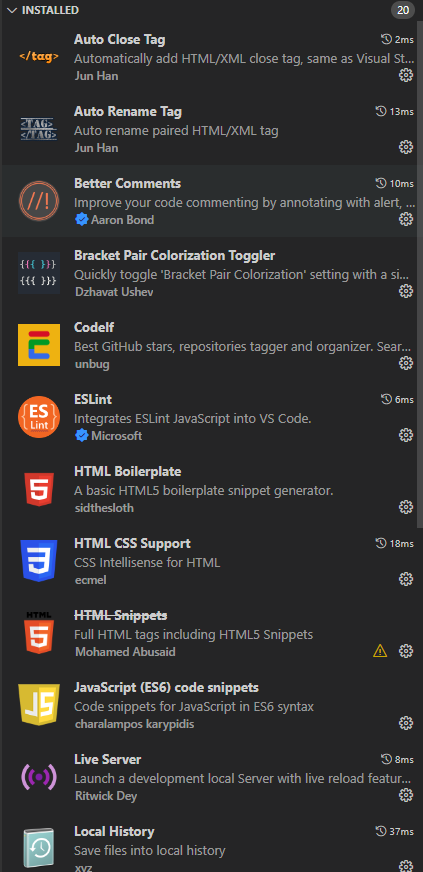

## 前端基础知识

## 1、了解ES6

- **ECMAScript 6.0**（以下简称 ES6，ECMAScript 是一种由 Ecma 国际(前身为欧洲计算机制造商

  协会,英文名称是 European Computer Manufacturers Association)通过 ECMA-262标准化的脚本

  程序设计语言）**是** **JavaScript** **语言的下一代标准**

- ECMAScript是浏览器脚本语言的规范，而各种我们熟知的js语言，如 JavaScript 则是

  规范的具体实现。

### 2、常用插件

- 常用插件1：
- 常用插件2：

### 3、基本语法

​       

