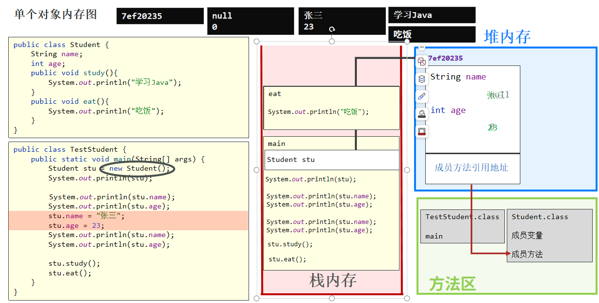
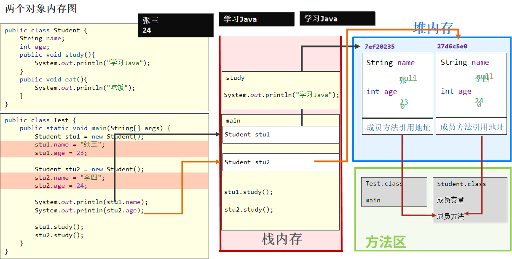
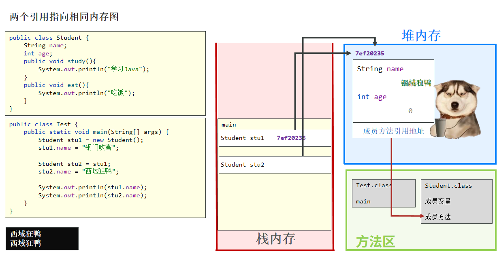
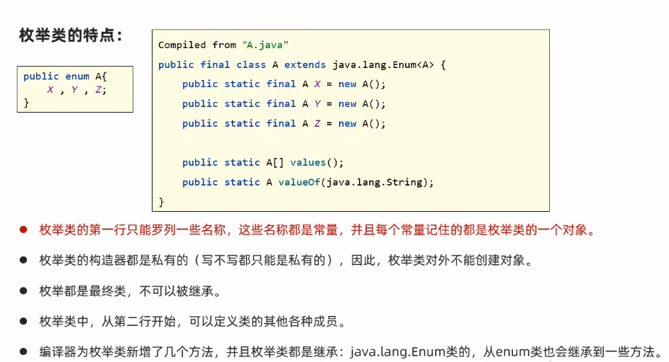
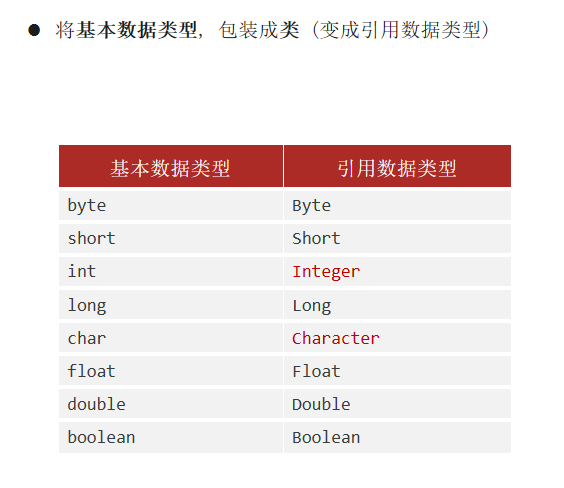
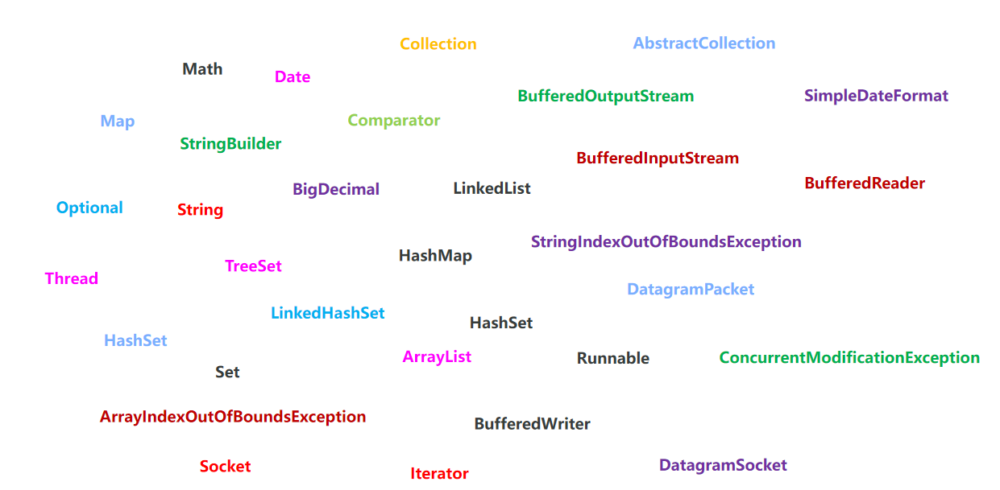
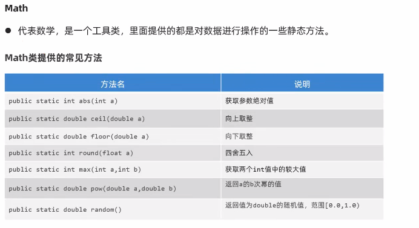
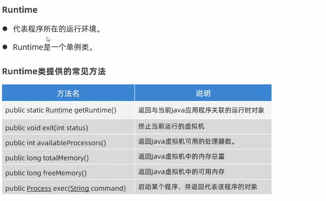
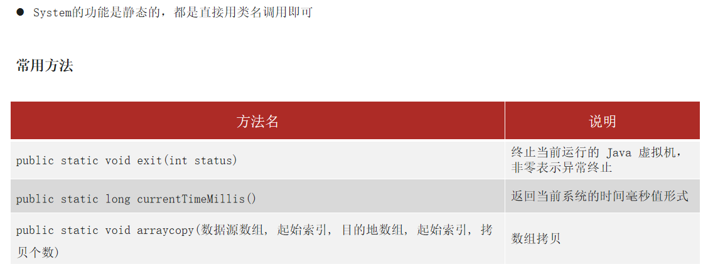
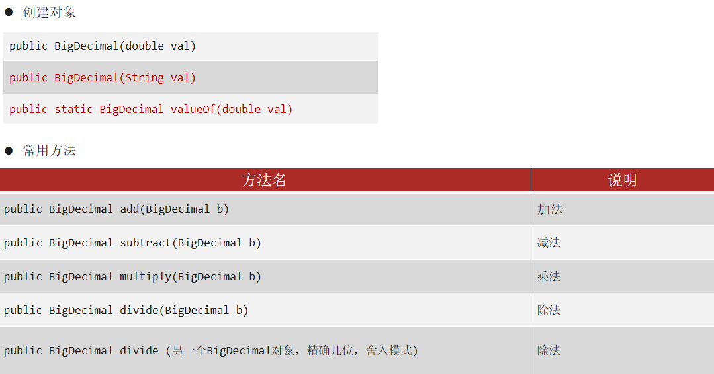

##   Java基础

### 面向对象
- 并不是一个技术，而是一种编程的指导思想
- 为什么要学习面向对象？
  > 因为生活中，我们解决问题时，就是采用这种指导思想去解决的
  > 所以，我们写程序去解决问题时，如果也能采用这种指导思想
  > 就会使编程变得非常简单，程序也便于人理解 

### 类和对象

- Java 中想要创建对象，必须先要有类的存在
- 类指的是一组相关属性和行为的集合，我们将其理解为是一张对象的设计图
- Java 中需要根据类，创建对象
- 一个类，可以创建出多个对象
- 类的组成 :
  - 成员变量：指描述事物的名词
  - 成员方法：指描述事物的动词

### 类和对象内存图

- 

- 

- 

### static 

- 静态。可修饰成员变量、成员方法。
- 分类：成员变量按有无static修饰分为：
  - 类变量（静态变量）：有static修饰，属于类本身
  - 实例变量：无static修饰，属于每个对象
- 静态变量特点
  - 归属：属于类本身持有
  - 内存：在内存中只加载一份
  - 共享性：被类和类的全部对象共享
  - 访问方式：推荐使用类名访问（如Student.name），也可用对象访问但不推荐
- 实例变量特点
  - 归属：属于每个对象
  - 内存：每个对象都有独立副本
  - 访问限制：只能通过对象访问（如s1.age）
- 内存原理
  - 静态变量存储在堆内存的静态区域，所有对象共享同一份
  - 实例变量存储在对象实例中，每个对象有独立副本
- static 修饰成员的特点
  - 被其修饰的成员, 被该类的所有对象所共享
  - 多了一种调用方式, 可以通过类名调用
  - 随着类的加载而加载, 优先于对象存在
- 使用场景：
  - 成员变量：需要共享的数据
  - 成员方法：工具类的方法大多数是 static 的

### 成员变量的局部变量区别

| 区别         | 成员变量                                   | 局部变量                                       |
| ------------ | ------------------------------------------ | ---------------------------------------------- |
| 类中位置不同 | 方法外                                     | 方法中                                         |
| 初始化值不同 | 有默认初始化值                             | 没有，使用之前需要完成赋值                     |
| 内存位置不同 | 堆内存                                     | 栈内存                                         |
| 生命周期不同 | 随着对象的创建而存在，随着对象的消失而消失 | 随着方法的调用而存在，随着方法的运行结束而消失 |
| 作用域       | 在自己所归属的大括号中                     |                                                |

### this、super关键字

| **关键字** | **访问成员变量**    | **访问成员方法**      | **访问构造方法**               |
| ---------- | ------------------- | --------------------- | ------------------------------ |
| this       | this.本类成员变量;  | this.本类成员方法();  | this(); this(…);本类构造方法   |
| super      | super.父类成员变量; | super.父类成员方法(); | super(); super(…);父类构造方法 |
- this 代表当前类对象的引用（地址）
- this：代表本类对象的引用
- super：代表父类存储空间的标识

### 权限修饰符

| 权限修饰符 | 同一个类中 | 同一个包中 | 不同包的子类 | 不同包的无关类 |
| ---------- | ---------- | ---------- | ------------ | -------------- |
| private    | √          |            |              |                |
| (default)  | √          | √          |              |                |
| protected  | √          | √          | √            |                |
| public     | √          | √          | √            | √              |

### 继承

- Java只支持单继承，不支持多继承，但支持多层继承

### 枚举

- 基本定义：枚举是一种特殊类，使用关键字enum声明，格式为：修饰符 enum 枚举类名{名称1，名称2，...；其他成员...}
- 构造器特性：枚举类的构造器默认且只能是私有的，因此不能通过new关键字创建对象实例
- 继承特性：枚举类都是final类，不能被继承，保证了枚举实例的唯一性和不可变性
- 底层实现：反编译后枚举类继承自java.lang.Enum，第一行罗列的名称会被编译为public static final常量
- 新增方法：编译器会自动为枚举类添加values()和valueOf()方法，前者获取所有枚举实例数组，后者通过名称获取枚举实例
- 继承方法：从Enum类继承ordinal()方法，可以获取枚举实例的序号（从0开始）
- 实例控制：枚举类通过私有构造器严格控制实例数量，只能通过预定义的常量名称获取实例
- 多例模式：枚举类被称为"多例模式"，因为其实例数量固定且有限（如X,Y,Z三个实例）
- 线程安全：枚举实例在类加载时创建，天生线程安全，适合实现单例模式

### 泛型

- 基本概念：在定义类、接口或方法时，同时声明一个或多个类型变量，称为泛型类、泛型接口、泛型方法，统称为泛型
- 识别特征：任何带有尖括号类型变量的类、接口或方法都称为泛型
- 泛型的作用：
  - 编译时约束：在编译阶段约束操作的数据类型，避免强制类型转换及其可能出现的异常。
  - 类型统一：确保集合中只能操作某种特定数据类型。
  - 避免强制转换：使用泛型的ArrayList需要强制转换，当遇到Boolean类型转String时会抛出ClassCastException异常。

### Object类

- Object类是Java中所有类的超类，任何类都直接或间接继承自Object类
- 通用方法特性：所有类的对象都可以直接使用Object类中提供的通用方法，实现"一劳永逸"的设计思想

### Objects类

- 替代对象比较：在Java开发中，Sun公司官方代码使用Objects.equals()而非对象自身的equals()方法进行对象比较
- 空指针问题：当主调对象为null时，直接调用equals()会抛出NullPointerException，而Objects.equals()能安全处理null值
- equals方法
  - 安全比较：public static boolean equals(Object a, Object b)先做非空判断再比较
  - 源码原理：实现逻辑为return (a == b) || (a != null && a.equals(b))
  - 使用场景：比较两个对象内容时推荐使用，特别是可能为null的对象
  - 优势对比
    - 传统equals：t1.equals(t2)在t1为null时抛出异常
    - Objects.equals：Objects.equals(t1,t2)返回false不报错
- isNull方法
  - 功能：public static boolean isNull(Object obj)判断对象是否为null
  - 等价写法：obj == null，但使用isNull()方法更符合工具类规范
  - 源码实现：直接返回obj == null的判断结果
- nonNull方法
  - 功能：public static boolean nonNull(Object obj)判断对象是否非null
  - 等价写法：obj != null，工具类方法更具可读性
  - 源码实现：直接返回obj != null的判断结果

### 包装类

### 

- 设计初衷：实现Java"万物皆对象"的核心思想，解决8种基本数据类型不是对象的问题
- 必要性：基本类型数据存储在栈内存，而对象存储在堆内存，包装类可将基本类型"包装"成对象
- 应用场景：泛型和集合只能操作对象，不支持基本类型，必须使用包装类

### 常用API

- StringBuilder：可变字符串对象: 相当于一个容器，内部字符串内容可以改变，专门用于字符串操作
  - 优势: 比String更适合字符串修改操作，效率更高，代码更简洁
  - 构造器
    - public StringBuilder()：创建空白可变字符串对象
    - public StringBuilder(String str)：创建指定内容的可变字符串对象
  - 核心方法
    - append(任意类型)：添加数据并返回对象本身（支持链式编程）
    - reverse()：反转内容
    - length()：返回内容长度
    - toString()：转换为String对象
- StringBuffer与StringBuilder

  |               | 线程安全性                           | 性能差异                            | 使用场景           |
  | ------------- | ------------------------------------ | ----------------------------------- | ------------------ |
  | StringBuffer  | 线程安全的（方法加synchronized修饰） | StringBuilder性能略优于StringBuffer | 多线程环境考虑使用 |
  | StringBuilder | 是线程不安全                         | StringBuilder性能略优于StringBuffer | 单线程环境优先使用 |

### StringJoiner

- 基本特性
  - JDK8新增的字符串操作类
  - 与StringBuilder类似，都是可变字符串容器
  - 性能高效且在某些场景下代码更简洁
- 适用场景
  - 特别适合需要自动处理间隔符的字符串拼接
  - 适用于不确定是否到达最后一个数据的遍历拼接

- 性能问题：String拼接字符串速度慢，StringBuilder虽然快但需要手动处理间隔符号
- 代码简洁性：StringBuilder需要判断是否为最后一个数据来添加间隔符，代码编写较繁琐

### Math

### 

### Runtime

### 

### System

### BigDecimal

- 用于解决小数运算中, 出现的不精确问题

### LocalDate、LocalTime、LocalDateTime

#### ZonedId、ZonedDateTime

> 02阶段：java进阶+ai  >  day04-常用API > 06、LocalDate、LocalTime、LocalDateTime
