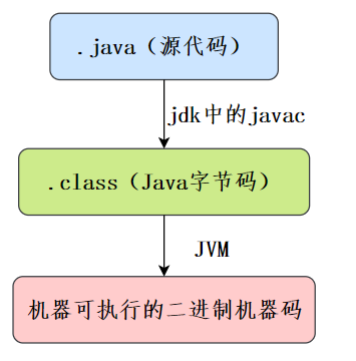

## java面试

### 基础

- java语言有那些特点

  - 简单易学；

  - 面向对象（封装，继承，多态）；

    - 继承：继承是从已有类得到继承信息创建新类的过程；
    - 封装：封装是把数据和操作数据的方法绑定起来，对数据的访问只能通过已定义的接口
    - 多态性：多态性是指允许不同子类型的对象对同一消息作出不同的响应

  - 平台无关性（ Java 虚拟机实现平台无关性）；

  - 支持多线程（ C++ 语言没有内置的多线程机制，因此必须调用操作系统的多线程功能来进行多线程程序设计，而 Java 语言却提供了多线程支持）；

  - 可靠性（具备异常处理和自动内存管理机制）；

  - 安全性（Java 语言本身的设计就提供了多重安全防护机制如访问权限修饰符、限制程序直接访问操作系统资源）；

  - 高效性（通过 Just In Time 编译器等技术的优化，Java 语言的运行效率还是非常不错的）；

  - 支持网络编程并且很方便；

  - 编译与解释并存；

    > 直到今天，依然有很多人觉得跨平台是 Java 语言最大的优势。实际上，跨平台已经不是 Java 最大的卖点了，各种 JDK 新特性也不是。目前市面上虚拟化技术已经非常成熟，比如你通过 Docker 就很容易实现跨平台了。在我看来，Java 强大的生态才是

- 说说什么是跨平台性？原理是什么?

  - 所谓跨平台性，是指Java语言编写的程序，一次编译后，可以在多个系统平台上运行。实现原理：Java程序是通过Java虚拟机在系统平台上运行的，只要该系统可以安装相应的Java虚拟机，该系统就可以运行java程序。

- 什么是字节码？采用字节码的好处是什么?

  - 所谓的字节码，就是Java程序经过编译之类产生的.class文件，字节码能够被虚拟机识别，从而实现Java程序的跨平台性。   

- java源代码到运行流程

  - 编译：将我们的代码（.java）编译成虚拟机可以识别理解的字节码(.class)
  - 解释：虚拟机执行Java字节码，将字节码翻译成机器能识别的机器码
  - 执行：对应的机器执行二进制机器码

   

  > 只需要把Java程序编译成Java虚拟机能识别的Java字节码，不同的平台安装对应的Java虚拟机，这样就可以可以实现Java语言的平台无关性。

- 为什么说 **Java** 语言**“**编译与解释并存**”**？

  - Java 语言既具有编译型语言的特征，也具有解释型语言的特征，因为 Java 程序要经过先编译，后解释两个步骤，由 Java 编写的程序需要先经过编译步骤，生成字节码（ \*.class 文件），这种字节码必须再经过JVM，解释成操作系统能识别的机器码，在由操作系统执行。因此，我们可以认为 Java 语言编译与解释并存。

    

- 

### 数据库

### 框架

### 中间件

