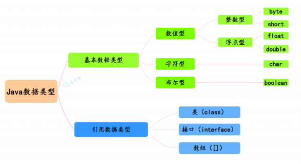
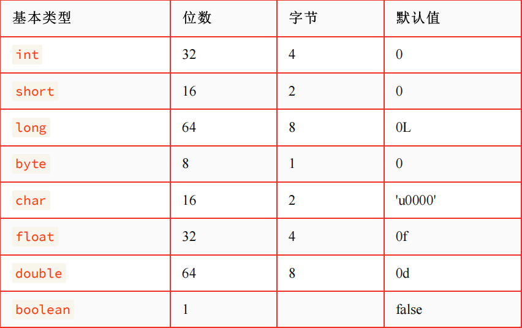
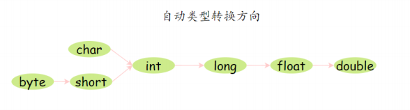
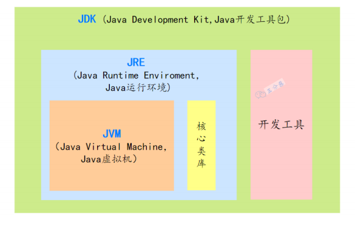
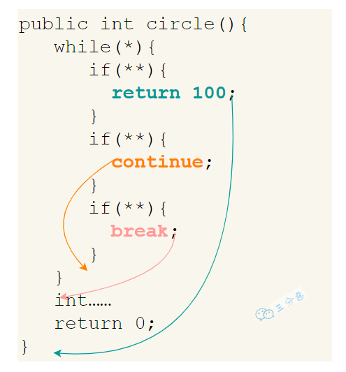
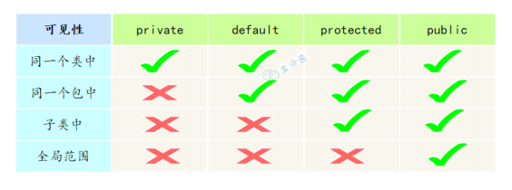

## java面试

### 基础

- java语言有那些特点

  - 简单易学；

  - 面向对象（封装，继承，多态）；

    - 继承：继承是从已有类得到继承信息创建新类的过程；
    - 封装：封装是把数据和操作数据的方法绑定起来，对数据的访问只能通过已定义的接口
    - 多态性：多态性是指允许不同子类型的对象对同一消息作出不同的响应

  - 平台无关性（ Java 虚拟机实现平台无关性）；

  - 支持多线程（ C++ 语言没有内置的多线程机制，因此必须调用操作系统的多线程功能来进行多线程程序设计，而 Java 语言却提供了多线程支持）；

  - 可靠性（具备异常处理和自动内存管理机制）；

  - 安全性（Java 语言本身的设计就提供了多重安全防护机制如访问权限修饰符、限制程序直接访问操作系统资源）；

  - 高效性（通过 Just In Time 编译器等技术的优化，Java 语言的运行效率还是非常不错的）；

  - 支持网络编程并且很方便；

  - 编译与解释并存；

    > 直到今天，依然有很多人觉得跨平台是 Java 语言最大的优势。实际上，跨平台已经不是 Java 最大的卖点了，各种 JDK 新特性也不是。目前市面上虚拟化技术已经非常成熟，比如你通过 Docker 就很容易实现跨平台了。在我看来，Java 强大的生态才是

- 说说什么是跨平台性？原理是什么?

  - 所谓跨平台性，是指Java语言编写的程序，一次编译后，可以在多个系统平台上运行。实现原理：Java程序是通过Java虚拟机在系统平台上运行的，只要该系统可以安装相应的Java虚拟机，该系统就可以运行java程序。

- 什么是字节码？采用字节码的好处是什么?

  - 所谓的字节码，就是Java程序经过编译之类产生的.class文件，字节码能够被虚拟机识别，从而实现Java程序的跨平台性。   

- java源代码到运行流程

  - 编译：将我们的代码（.java）编译成虚拟机可以识别理解的字节码(.class)
  - 解释：虚拟机执行Java字节码，将字节码翻译成机器能识别的机器码
  - 执行：对应的机器执行二进制机器码

   

  > 只需要把Java程序编译成Java虚拟机能识别的Java字节码，不同的平台安装对应的Java虚拟机，这样就可以可以实现Java语言的平台无关性。

- 为什么说 **Java** 语言**“**编译与解释并存**”**？

  - Java 语言既具有编译型语言的特征，也具有解释型语言的特征，因为 Java 程序要经过先编译，后解释两个步骤，由 Java 编写的程序需要先经过编译步骤，生成字节码（ \*.class 文件），这种字节码必须再经过JVM，解释成操作系统能识别的机器码，在由操作系统执行。因此，我们可以认为 Java 语言编译与解释并存。

    

- **Java**有哪些数据类型

  

  - 定义：Java语言是强类型语言，对于每一种数据都定义了明确的具体的数据类型，在内存中分配了不同大小的内存空间。

  - Java语言数据类型分为两种：基本数据类型和引用数据类型。

  - 基本数据类型：

    

    - 整数类型（byte、short、long）

    - 浮点类型（float、double）

    - 字符型（char）

    - 布尔型（boolean）

- 自动类型转换、强制类型转换

  - Java 所有的数值型变量可以相互转换，当把一个表数范围小的数值或变量直接赋给另一个表数范围大的变量时，可以进行自动类型转换；反之，需要强制转换。

    

    > float f=3.4 ，对吗？
    >
    > 不正确。3.4 是单精度数，将双精度型（double）赋值给浮点型（float）属于下转型（down-casting，也称为窄化）会造成精度损失，因此需要强制类型转换 float f =(float)3.4; 或者写成 float f =3.4F

    > short s1 = 1; s1 = s1 + 1； 对吗？ short s1 = 1; s1 += 1; 对吗？
    >
    > 对于 short s1 = 1; s1 = s1 + 1;编译出错，由于 1 是 int 类型，因此 s1+1 运算结果也是 int型，需要强制转换类型才能赋值给 short 型。
    >
    > 而 short s1 = 1; s1 += 1;可以正确编译，因为 s1+= 1;相当于 s1 =(short(s1 + 1);其中有隐含的强制类型转换。

- **JVM**、**JDK** 和 **JRE** 有什么区别

  

  - **JVM**：Java Virtual Machine，Java虚拟机，Java程序运行在Java虚拟机上。针对不同系统的实现（Windows，Linux，macOS）不同的JVM，因此Java语言可以实现跨平台。
  - **JRE**： Java 运⾏时环境。它是运⾏已编译 Java 程序所需的所有内容的集合，包括Java 虚拟机（JVM），Java 类库，Java 命令和其他的⼀些基础构件。但是，它不能⽤于创建新程序。
  - **JDK**: Java Development Kit，它是功能⻬全的 Java SDK。它拥有 JRE 所拥有的⼀切，还有编译器（javac）和⼯具（如 javadoc 和 jdb）。它能够创建和编译程序。

  > 简单来说，JDK包含JRE，JRE包含JVM

- 什么是 **AOT(Ahead of Time Compilation)** 

  - JDK 9 引入了一种新的编译模式 **AOT(Ahead of Time Compilation)** 。和 JIT 不同的是，这种编译模式会在程序被执行前就将其编译成机器码，属于静态编译（C、 C++，Rust，Go 等语言就是静态编译）。AOT 避免了 JIT 预热等各方面的开销，可以提高 Java 程序的启动速度，避免预热时间长。并且，AOT 还能减少内存占用和增强 Java 程序的安全性（AOT 编译后的代码不容易被反编译和修改），特别适合云原生场景。
  - AOT 的主要优势在于启动时间、内存占用和打包体积。JIT 的主要优势在于具备更高的极限处理能力，可以降低请求的最大延迟。
  - AOT 更适合当下的云原生场景，对微服务架构的支持也比较友好。除此之外，AOT 编译无法支持 Java 的一些动态特性，如反射、动态代理、动态加载、JNI（Java Native Interface）等

- **switch** 是否能作用在 **byte/long/String**上

  - Java5 以前 switch(expr)中，expr 只能是 byte、short、char、int。从 Java 5 开始，Java 中引入了枚举类型， expr 也可以是 enum 类型。从 Java 7 开始，expr还可以是字符串(String)，但是长整型(long)在目前所有的版本中都是不可以的。

- **break ,continue ,return** 的区别及作用

  

  - break 跳出整个循环，不再执行循环( 结束当前的循环体 )

  - continue 跳出本次循环，继续执行下次循环( 结束正在执行的循环 进入下一个循

    环条件 )

  - return 程序返回，不再执行下面的代码( 结束当前的方法 直接返回 )

- 用最有效率的方法计算**2**乘以**8**？

  - 2 << 3。位运算，数字的二进制位左移三位相当于乘以2的三次方

- **⾯**向对象和**⾯**向过程的区别

  - ⾯向过程 ：面向过程就是分析出解决问题所需要的步骤，然后用函数把这些步骤一步一步实现，使用的时候再一个一个的一次调用就可以。
  - ⾯向对象 ：面向对象，把构成问题的事务分解成各个对象，而建立对象的目的也不是为了完成一个个步骤，而是为了描述某个事件在解决整个问题的过程所发生的行为。 目的是为了写出通用的代码，加强代码的重用，屏蔽差异性。

- 重载（**overload**）和重写（**override**）的区别

  - 方法的重载和重写都是实现多态的方式，区别在于前者实现的是编译时的多态性，而后者实现的是运行时的多态性
  - 重载发生在一个类中，同名的方法如果有不同的参数列表（参数类型不同、参数个数不同或者二者都不同）则视为重载；重写发生在子类与父类之间，重写要求子类被重写方法与父类被重写方法有相同的返回类型，比父类被重写方法更好访问，不能比父类被重写方法声明更多的异常（里氏代换原则）。

- 访问修饰符**public**、**private**、**protected**、以及不写（默认）时的区别

  

  - default (即默认，什么也不写）: 在同一包内可见，不使用任何修饰符。可以修饰在类、接口、变量、方法。
  - private : 在同一类内可见。可以修饰变量、方法。 注意：不能修饰类（外部类）
  - public : 对所有类可见。可以修饰类、接口、变量、方法
  - protected : 对同一包内的类和所有子类可见。可以修饰变量、方法。 注意：不能修饰类（外部类） 

- 抽象类**(abstract class)**和接口**(interface)**有什么区别

  - **1.** 接⼝的⽅法默认是 public ，所有⽅法在接⼝中不能有实现(Java 8 开始接⼝⽅法可以有默认实现），⽽抽象类可以有⾮抽象的⽅法。

  - **2.** 接⼝中除了 static 、 final 变量，不能有其他变量，⽽抽象类中则不⼀定

  - **3.** ⼀个类可以实现多个接⼝，但只能实现⼀个抽象类。接⼝⾃⼰本身可以通过extends 关键字扩展多个接⼝。

  - **4.** 接⼝⽅法默认修饰符是 public ，抽象⽅法可以有 public 、 protected 和 default 这些修饰符（抽象⽅法就是为了被重写所以不能使⽤ private 关键字修饰！）。

  - **5.** 从设计层⾯来说，抽象是对类的抽象，是⼀种模板设计，⽽接⼝是对⾏为的抽象，是⼀种⾏为的规范。

    > **1.** 在 JDK8 中，接⼝也可以定义静态⽅法，可以直接⽤接⼝名调⽤。实现类和实现是不可以调⽤的。如果同时实现两个接⼝，接⼝中定义了⼀样的默认⽅法，则必须重写，不然会报错。
    >
    > **2.** jdk9 的接⼝被允许定义私有⽅法 。
    >
    > 总结⼀下 jdk7~jdk9 Java 中接⼝的变化：
    >
    > **1.** 在 jdk 7 或更早版本中，接⼝⾥⾯只能有常量变量和抽象⽅法。这些接⼝⽅法必
    >
    > 须由选择实现接⼝的类实现。
    >
    > **2.** jdk 8 的时候接⼝可以有默认⽅法和静态⽅法功能。
    >
    > **3.** jdk 9 在接⼝中引⼊了私有⽅法和私有静态⽅法。

- 成员变量与局部变量的区别

  - **1.** 从语法形式上看 ：成员变量是属于类的，⽽局部变量是在⽅法中定义的变量或是⽅法的参数；成员变量可以被 public , private , static 等修饰符所修饰，⽽局部变量不能被访问控制修饰符及 static 所修饰；但是，成员变量和局部变量都能被final 所修饰。
  - **2.** 从变量在内存中的存储⽅式来看 ：如果成员变量是使⽤ static 修饰的，那么这个成员变量是属于类的，如果没有使⽤ static 修饰，这个成员变量是属于实例的。对象存于堆内存，如果局部变量类型为基本数据类型，那么存储在栈内存，如果为引⽤数据类型，那存放的是指向堆内存对象的引⽤或者是指向常量池中的地址。
  - **3.** 从变量在内存中的⽣存时间上看 ：成员变量是对象的⼀部分，它随着对象的创建⽽存在，⽽局部变量随着⽅法的调⽤⽽⾃动消失。
  - **4.** 成员变量如果没有被赋初值 ：则会⾃动以类型的默认值⽽赋值（⼀种情况例外:被 final 修饰的成员变量也必须显式地赋值），⽽局部变量则不会⾃动赋值。

- 静态变量和实例变量的区别？静态方法、实例方法呢？

  - 静态变量**:** 是被 static 修饰符修饰的变量，也称为类变量，它属于类，不属于类的任何一个对象，一个类不管创建多少个对象，静态变量在内存中有且仅有一个副本。
  - 实例变量**:** 必须依存于某一实例，需要先创建对象然后通过对象才能访问到它。静态变量可以实现让多个对象共享内存。
  - 静态方法：static修饰的方法，也被称为类方法。在外部调⽤静态⽅法时，可以使⽤"类名**.****⽅**法名"的⽅式，也可以使⽤"对象名**.⽅**法名"的⽅式。静态方法里不能访问类的非静态成员变量和方法。**
  - **实例**⽅**法：依存于类的实例，需要使用"对象名**.⽅**法名"的⽅式调用；可以访问类的所有成员变量和方法

- **final**关键字有什么作用

  - final表示不可变的意思，可用于修饰类、属性和方法：
  - 被final修饰的类不可以被继承
  - 被final修饰的方法不可以被重写
  - 被final修饰的变量不可变，被final修饰的变量必须被显式第指定初始值，还得注意的是，这里的不可变指的是变量的引用不可变，不是引用指向的内容的不可变

### 数据库

### 框架

### 中间件

