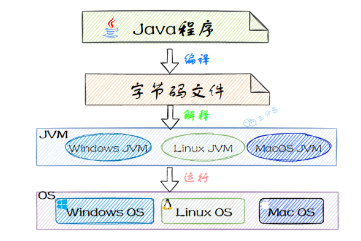

## java面试

### 基础

- java语言有那些特点

  - 简单易学；

  - 面向对象（封装，继承，多态）；

    - 继承：继承是从已有类得到继承信息创建新类的过程；
    - 封装：封装是把数据和操作数据的方法绑定起来，对数据的访问只能通过已定义的接口
    - 多态性：多态性是指允许不同子类型的对象对同一消息作出不同的响应

  - 平台无关性（ Java 虚拟机实现平台无关性）；

  - 支持多线程（ C++ 语言没有内置的多线程机制，因此必须调用操作系统的多线程功能来进行多线程程序设计，而 Java 语言却提供了多线程支持）；

  - 可靠性（具备异常处理和自动内存管理机制）；

  - 安全性（Java 语言本身的设计就提供了多重安全防护机制如访问权限修饰符、限制程序直接访问操作系统资源）；

  - 高效性（通过 Just In Time 编译器等技术的优化，Java 语言的运行效率还是非常不错的）；

  - 支持网络编程并且很方便；

  - 编译与解释并存；

    > 直到今天，依然有很多人觉得跨平台是 Java 语言最大的优势。实际上，跨平台已经不是 Java 最大的卖点了，各种 JDK 新特性也不是。目前市面上虚拟化技术已经非常成熟，比如你通过 Docker 就很容易实现跨平台了。在我看来，Java 强大的生态才是

- 说说什么是跨平台性？原理是什么?

  - 所谓跨平台性，是指Java语言编写的程序，一次编译后，可以在多个系统平台上运行。实现原理：Java程序是通过Java虚拟机在系统平台上运行的，只要该系统可以安装相应的Java虚拟机，该系统就可以运行java程序。

- 什么是字节码？采用字节码的好处是什么?

  - 所谓的字节码，就是Java程序经过编译之类产生的.class文件，字节码能够被虚拟机识别，从而实现Java程序的跨平台性。   

- java源代码到运行流程

  - 编译：将我们的代码（.java）编译成虚拟机可以识别理解的字节码(.class)
  - 解释：虚拟机执行Java字节码，将字节码翻译成机器能识别的机器码
  - 执行：对应的机器执行二进制机器码

   

  > 只需要把Java程序编译成Java虚拟机能识别的Java字节码，不同的平台安装对应的Java虚拟机，这样就可以可以实现Java语言的平台无关性。

- 为什么说 **Java** 语言**“**编译与解释并存**”**？

  - Java 语言既具有编译型语言的特征，也具有解释型语言的特征，因为 Java 程序要经过先编译，后解释两个步骤，由 Java 编写的程序需要先经过编译步骤，生成字节码（ \*.class 文件），这种字节码必须再经过JVM，解释成操作系统能识别的机器码，在由操作系统执行。因此，我们可以认为 Java 语言编译与解释并存。

    

- **Java**有哪些数据类型

  

  - 定义：Java语言是强类型语言，对于每一种数据都定义了明确的具体的数据类型，在内存中分配了不同大小的内存空间。

  - Java语言数据类型分为两种：基本数据类型和引用数据类型。

  - 基本数据类型：

    

    - 整数类型（byte、short、long）

    - 浮点类型（float、double）

    - 字符型（char）

    - 布尔型（boolean）

- 自动类型转换、强制类型转换

  - Java 所有的数值型变量可以相互转换，当把一个表数范围小的数值或变量直接赋给另一个表数范围大的变量时，可以进行自动类型转换；反之，需要强制转换。

    

    > float f=3.4 ，对吗？
    >
    > 不正确。3.4 是单精度数，将双精度型（double）赋值给浮点型（float）属于下转型（down-casting，也称为窄化）会造成精度损失，因此需要强制类型转换 float f =(float)3.4; 或者写成 float f =3.4F

    > short s1 = 1; s1 = s1 + 1； 对吗？ short s1 = 1; s1 += 1; 对吗？
    >
    > 对于 short s1 = 1; s1 = s1 + 1;编译出错，由于 1 是 int 类型，因此 s1+1 运算结果也是 int型，需要强制转换类型才能赋值给 short 型。
    >
    > 而 short s1 = 1; s1 += 1;可以正确编译，因为 s1+= 1;相当于 s1 =(short(s1 + 1);其中有隐含的强制类型转换。

### 数据库

### 框架

### 中间件

